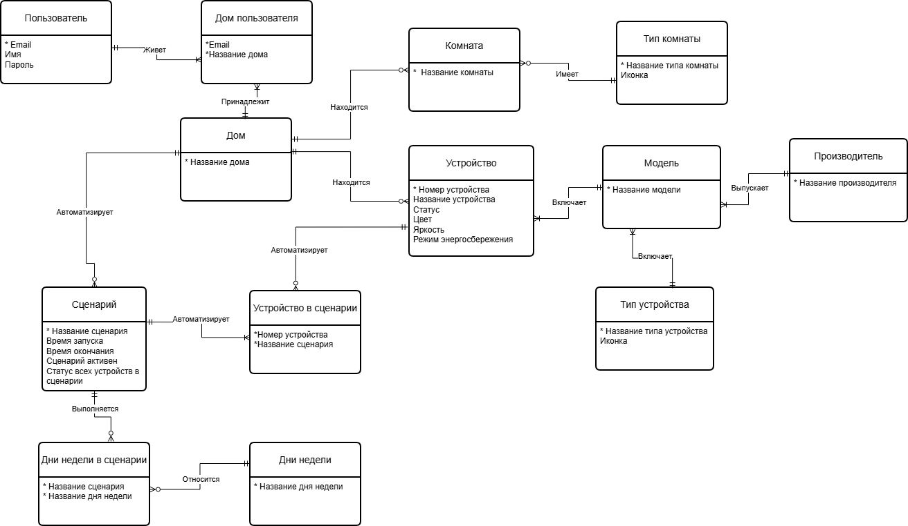
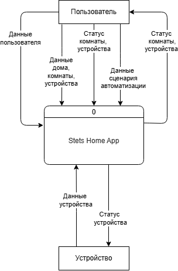
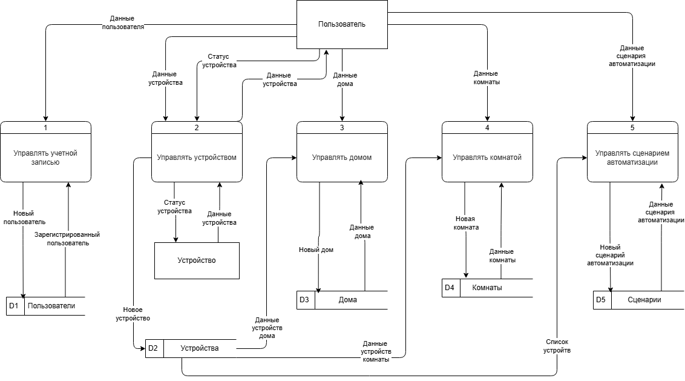
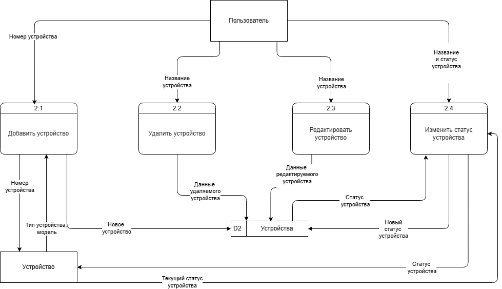
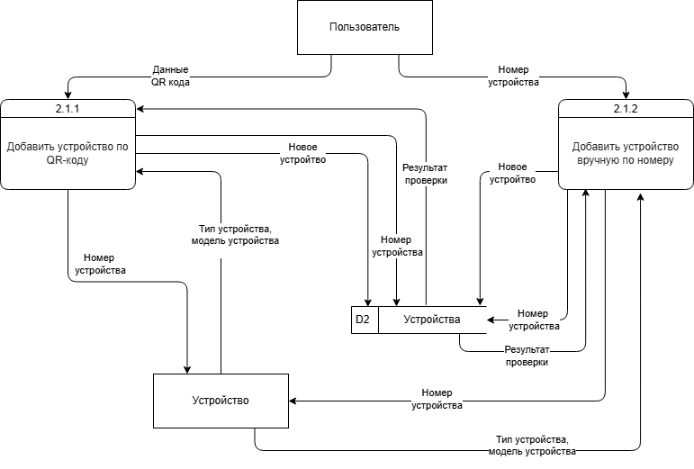

# Приложение для управления умным домом

## Описание проекта
Производитель устройств для умного дома Stets планирует разработать собственное мобильное приложение.  Ключевая особенность продукта - поддержка фирменного режима энергосбережения, которого нет в существующих приложениях конкурентов.

## Цель 
Спроектировать требования для первой версии мобильного приложения Stets Home - от анализа потребностей заказчика и пользователей до передачи готовых артефактов команде разработки.

## Функционал (MVP)

Учётная запись
- Регистрация, вход, восстановление пароля

Управление домом
- Несколько домов для одного пользователя
- Совместный доступ к дому для членов семьи

Устройства
- Добавление умных лампочек по QR-коду или вручную
- Включение/выключение устройства
- Режим энергосбережения

Комнаты
- Создание комнат 
- Добавление устройств в комнату
- Управление всеми устройствами в комнате одной кнопкой

Сценарии автоматизации
- Создание сценариев с выбором устройств и команд
- Запуск сценария вручную и по расписанию

 ## Задачи
- Проанализировала интервью с заказчиком и пользователями, выявила и структурировала требования
- Разработала User Story Map с выделенным MVP
- Описала критерии и сценарии приёмки для User Story
- Спроектировала ER-диаграмму на логическом уровне
- Разработала DFD на контекстном и логическом уровне
- Создала интерактивные прототипы в Figma
- Составила словарь данных
- Разработала программу и методику испытаний

## Артефакты 

- User Story Map и критерии приёмки
[Открыть в Miro](https://miro.com/app/board/uXjVHYM38yA=/?share_link_id=498810586648)

- Прототип
[Открыть в Figma](https://www.figma.com/design/JZOboDwh9sQOrnSB7sheuN/%D0%9F%D1%80%D0%BE%D1%82%D0%BE%D1%82%D0%B8%D0%BF-Stets-Home?node-id=0-1&t=LKi5twMyMdOPSJGI-1)

- Словарь данных
[Открыть в Google Docs](https://docs.google.com/document/d/1276-x8iFPNH7Iqcgq_mFbPR6Dz7B2cwHO6XgllB5yfM/edit?usp=sharing)

- Программа и методика испытаний
  [Открыть в Google Docs](https://docs.google.com/document/d/1yjulCgIUL4ZXsj6LsSzUSR42SCCo4zZpwtTEMLeOh5o/edit?usp=sharing)

## Диаграммы ##

## ER-диаграмма (логический уровень) ##

## DFD (контекстная) ##

## DFD (логическая - уровень "0") ##

## DFD (логическая - уровень "1") ##

## DFD (логическая - уровень "2") ##

## Результаты
- Выявлены и задокументированы требования на основе анализа интервью с заказчиком и пользователями
- Определены границы MVP и функциональность следующих версий
- Спроектирована модель данных с учётом масштабирования: поддержка нескольких производителей и типов устройств 
- Смоделированы потоки данных между пользователем, приложением и устройствами на контекстном и логическом уровне
- Разработаны интерактивные прототипы ключевых пользовательских сценариев: регистрация, управление устройствами, 
  создание сценариев автоматизации
- Составлены словарь данных и программа и методика испытаний для передачи команде разработки

## Инструменты
- Miro - User Story Map
- Figma - интерактивные прототипы
- Draw.io - ER-диаграмма, DFD
- Google Docs - документация
